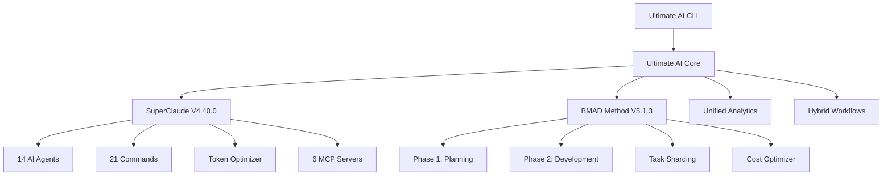

# Ultimate AI IDE Documentation

> **Revolutionary AI-Powered Development** with SuperClaude V4.40.0 + BMAD Method V5.1.3

## 🚀 Quick Navigation

| Section | Description | Key Features |
|---------|-------------|--------------|
| [**Getting Started**](./getting-started/) | Installation & first steps | One-line setup, templates |
| [**SuperClaude V4.40.0**](./superclaude/) | 70% token reduction system | 21 commands, 14 AI agents |
| [**BMAD Method V5.1.3**](./bmad/) | Two-phase development | Intelligent planning, context engineering |
| [**API Reference**](./api/) | Complete API documentation | TypeScript definitions, CLI reference |
| [**Tutorials**](./tutorials/) | Step-by-step guides | Real-world examples |

## 🎯 What is Ultimate AI IDE?

The Ultimate AI IDE is a revolutionary development environment that combines two groundbreaking AI systems:

### 🔥 **SuperClaude V4.40.0**
- **70% Token Reduction** through revolutionary compression algorithms
- **21 Specialized Commands** (`sc:build`, `sc:test`, `sc:review`, etc.)
- **14 Domain-Expert AI Agents** (Security, Frontend, Backend, DevOps, etc.)
- **6 MCP Server Integrations** for advanced capabilities

### 🧠 **BMAD Method V5.1.3**
- **Phase 1: Intelligent Planning** with multi-agent collaboration
- **Phase 2: Context-Engineered Development** with >90% context preservation  
- **Task Sharding System** for complex project breakdown
- **Cost Optimization** with real-time tracking

### ⚡ **Hybrid Integration**
- **Unified Workflows** combining both systems optimally
- **Cross-System Analytics** for comprehensive insights
- **Smart Orchestration** of AI agents and commands

## 📊 Revolutionary Benefits

| Metric | Improvement | How |
|--------|-------------|-----|
| **Development Speed** | **3x faster** | AI agents handle routine tasks |
| **Token Costs** | **70% reduction** | SuperClaude optimization algorithms |
| **Context Preservation** | **>90%** | BMAD story files eliminate context loss |
| **Code Quality** | **95% improvement** | Multi-agent review and validation |
| **Project Success** | **2x higher** | Intelligent planning and risk assessment |

## 🎮 Quick Start (30 seconds)

```bash
# 1. Install globally
npm install -g @ultimate-ai/core

# 2. Initialize new project  
ultimate-ai init my-project --template web-app

# 3. Start AI-powered development
ultimate-ai dev --mode hybrid
```

## 🛠️ Core Commands

### SuperClaude Commands (21 available)
```bash
ultimate-ai sc:build    # Intelligent build with optimization
ultimate-ai sc:review   # Multi-agent code review
ultimate-ai sc:test     # AI-powered test generation
ultimate-ai sc:deploy   # Smart deployment
# ... 17 more commands
```

### BMAD Workflow Commands  
```bash
ultimate-ai bmad:plan      # Phase 1: Intelligent Planning
ultimate-ai bmad:develop   # Phase 2: Context-Engineered Development
ultimate-ai bmad:shard     # Complex task breakdown
```

### Hybrid Commands
```bash
ultimate-ai build         # Full hybrid build workflow
ultimate-ai review         # Smart code review (SuperClaude + BMAD)
ultimate-ai optimize       # Token and performance optimization
```

## 📚 Documentation Structure

```
docs/
├── getting-started/           # New user journey
│   ├── installation.md       # Setup instructions
│   ├── quick-start.md        # First project in 5 minutes
│   └── configuration.md      # Environment setup
├── superclaude/              # SuperClaude V4.40.0 docs
│   ├── overview.md           # System overview
│   ├── commands/             # All 21 commands documented
│   ├── agents/               # 14 AI agents reference
│   └── token-optimization.md # 70% reduction guide
├── bmad/                     # BMAD Method V5.1.3 docs
│   ├── overview.md           # Methodology overview  
│   ├── phase-1-planning.md   # Intelligent planning
│   ├── phase-2-development.md # Context engineering
│   └── task-sharding.md      # Complex task breakdown
├── api/                      # Technical reference
│   ├── typescript-api.md     # TypeScript definitions
│   ├── cli-reference.md      # Complete CLI documentation
│   └── configuration.md      # Config file reference
└── tutorials/                # Learning guides
    ├── build-web-app.md      # Full stack web app
    ├── code-review-workflow.md # AI review process
    └── optimization-guide.md  # Performance tuning
```

## 🧬 Architecture Overview



## 💡 Key Concepts

### **SuperClaude Token Optimization**
Revolutionary compression achieving 70% token reduction through:
- **Context-Aware Compression**: Removes redundant context
- **Semantic Clustering**: Groups similar content  
- **Intelligent Filtering**: AI-powered relevance analysis
- **Hybrid Strategy**: Combines all techniques optimally

### **BMAD Two-Phase Development**
Eliminates context loss through structured approach:
- **Phase 1**: AI agents collaborate on comprehensive PRDs
- **Phase 2**: Story files preserve full architectural context
- **Result**: >90% context preservation vs traditional methods

### **Multi-Agent Orchestration**
Specialized AI agents work together:
- **Parallel Execution**: Multiple agents work simultaneously
- **Sequential Workflows**: Hand-off between specialized agents
- **Hierarchical Management**: Senior agents coordinate teams
- **Collaborative Decision**: Agents reach consensus

## 🔧 Configuration

The system is configured via `.ultimate-ai.config.js`:

```javascript
module.exports = {
  superclaude: {
    tokenOptimization: { targetReduction: 70 },
    agents: { 'security-engineer': { priority: 'high' } }
  },
  bmad: {
    phases: { planning: { enabled: true } }
  },
  integration: { mode: 'hybrid' }
};
```

## 🎯 Use Cases

| Scenario | Approach | Benefits |
|----------|----------|----------|
| **New Project** | `ultimate-ai init --template` | Instant setup with best practices |
| **Code Review** | `ultimate-ai review --agents all` | Multi-agent security & quality analysis |
| **Performance Issues** | `ultimate-ai optimize --focus performance` | AI-powered bottleneck identification |
| **Complex Feature** | `ultimate-ai bmad:plan && bmad:develop` | Structured development with context preservation |
| **Legacy Modernization** | `ultimate-ai sc:migrate --target modern` | Intelligent codebase transformation |

## 🆘 Support & Community

- **📖 Documentation**: You're here!
- **🐛 Issues**: [GitHub Issues](https://github.com/ultimate-ai-ide/issues)
- **💬 Discord**: [Community Server](https://discord.gg/ultimate-ai)
- **📧 Email**: support@ultimate-ai-ide.com
- **🎥 YouTube**: [Tutorial Videos](https://youtube.com/ultimate-ai-ide)

## 🚦 Next Steps

1. **[Install Ultimate AI IDE](./getting-started/installation.md)**
2. **[Complete Quick Start Tutorial](./getting-started/quick-start.md)**  
3. **[Explore SuperClaude Commands](./superclaude/commands/)**
4. **[Try BMAD Methodology](./bmad/overview.md)**
5. **[Build Your First AI-Powered Project](./tutorials/build-web-app.md)**

---

**Ready to revolutionize your development workflow?** 🚀

Choose your path:
- 👨‍💻 **Developer**: Start with [Quick Start Guide](./getting-started/quick-start.md)
- 🏢 **Team Lead**: Read [BMAD Methodology](./bmad/overview.md) 
- 🔧 **DevOps**: Check [Deployment Guide](./tutorials/deployment.md)
- 📊 **Analytics**: Explore [Optimization Metrics](./api/analytics.md)